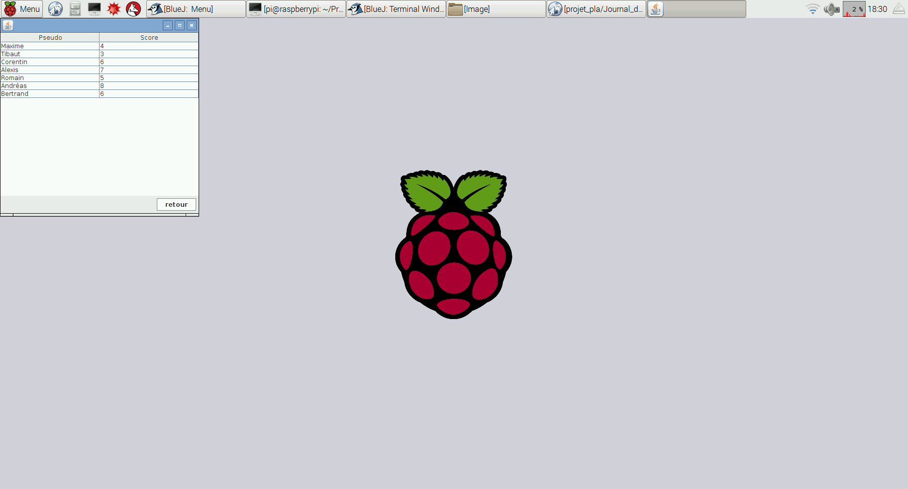

# Journal de bord

## Dimanche 3 juin
- Organisation du projet en sous-dossier
- Développement d'une nouvelle implémentation pour la gestion de la grille (classe Cell et Map)  

Comparaison du temps d'exécution de certaine action entre la nouvelle implémentation et l'ancienne avec une map de 1000 cellules avec 990 entités sur la map :

Actions | Nouvelle Implémentation| Ancienne implémentation^^1
---|---|---
Bouger  | 16 000ns = 0.016ms  |  185003ns = 0.18ms
Prendre entité  | 13 000ns = 0.013ms  |  167893ns = 0.16ms
Déposer entité  | 11 500ns = 0.011ms |  251881ns = 0.25ms
Initialisation map^^2  | 5 552 679ns = 5.5ms |  29 076 590ns = 29ms

^^1 Dans le pire cas, où la fonctions de colisions et de récuperation d'entité doivent parcourir toutes les entités (~900). La nouvelle implémentation ne dépend pas du nombre d'entité (juste du nombre d'entité de la cellule).  
^^2 Sans l'ouverture du fichier  
- Quelques optimisations de fonctions
- Début de developpement des téléporteurs entre les maps

## Vendredi 1 Juin :

### Design et conception
- Design sur le personnage principal, les monstres, les tourelles, entre autres  

- Développement en pixel art à l'aide de l'outil piskel
- Définition des Défis (carte sur le côté gauche)
- Finitions des maquettes de Défis

### Codage
- Début de l'IHM avec la Home Page
- Finitions de l'implémentation des différentes classes principales (voir diagramme UML) (Player, Entité, Mobs, Cristal)
- Implémentations des fonctions de base du modèle MVC pour ces classes (paint, move, etc)
- Amélioration de la fonction de création d'entités à partir d'un fichier
- Gestion des "colisions" entre les entités
- Début du developpement des fonctions pick, store, throw et getEntity

Voici une démonstration  du la création de map à partir d'un fichier, du personnage contrôlé par le clavier, la gestion de colision avec les obstacles (télés) et la possibilié de prendre et poser une tourelle (devant soi) :  

Voici des captures d'écran du menu du jeu et du tableau des scores (En cours de réalisation) , On peut passer du menu au tableau des scores et revenir au menu , quitter l'application soit avec le bouton quitter ou la croix en haut a droite.

## Jeudi 31 Mai :

- Prise en main de Swing, création de la map à l’aide d’un fichier texte
- Mouvement d’une entité sur cette map
- Mise en place du Gantt (planning)
- Création des mockups via MockFlow
- Modification du diagramme de classe
- Implémentation du diagramme de classe

## Mercredi 30 Mai :

- Création du diagramme de classe, création en brainstorming de toutes les  “entitées” (monstres, tourelles, personnage principal, obstacles,  armes) Voir Diagramme de classe ci dessous
- Début de réflexion sur Pop() -> Kamikaze et Wizz() -> Téléportation
- Description du “Bag” comme une collection/tableau d’entité
- Discussion à propos de la classe Weapon, ou ajout de classes pour chaque nouvelle tourelle et nouveaux monstres
- Discussion à propos des comportements sur les tourelles -> Récupérer tous les comportements qui existe puis les assigner aléatoirement à chaque tourelles. Cela permet la récupération/changement de comportement d’une tourelle en cours de partie
-Liste des tâches + Attribution

## Mardi 29 Mai :

Nous avons commencé à déterminer les différents concepts qui feront notre jeu (cf. Presentation jeu). Nous avons réfléchi à la manière de le rendre unique grâce aux automates, et à comment l’implémenter de façon permettant qu’on puisse facilement intégrer les automates des autres groupes.
