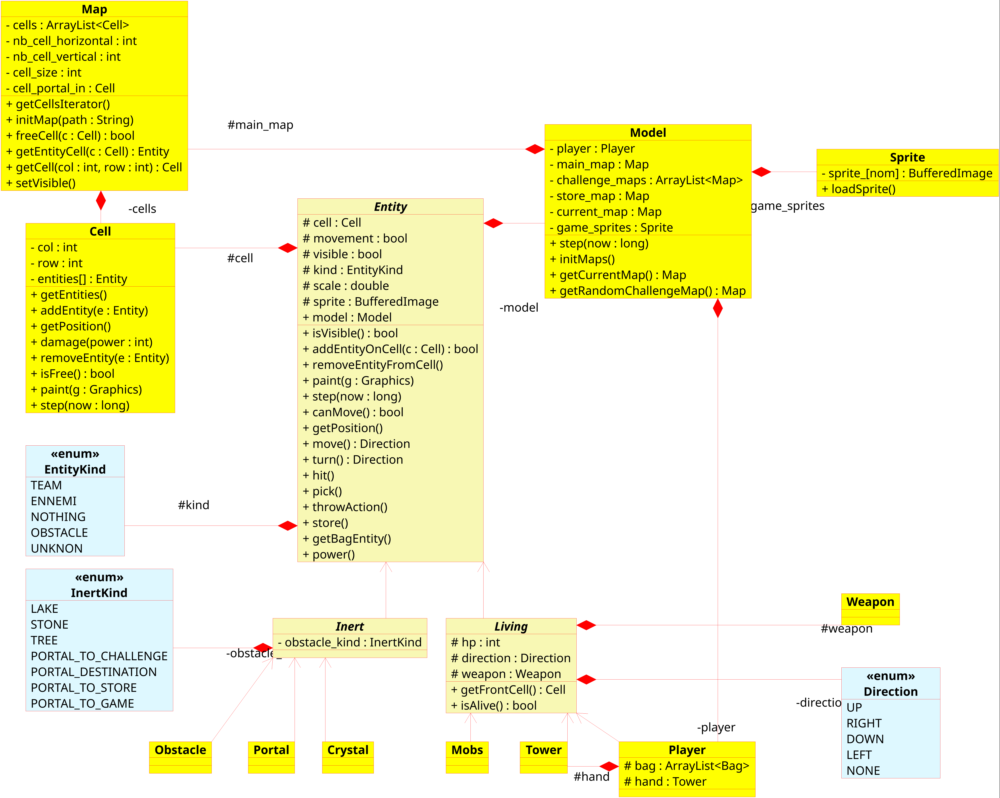

# Documentation (3 juin 2018)



```
projet
|-game.framework
|-game.sample
    |- edu.ricm3.game.tomatower
    |- maps
        |- challenges  
    |- sprites
```

## [TODO]
- **Amélioration de la fonction freeCell()**
- **Hit des entités**, principalement défini pour les Living (classe(s) Weapon, appelle de la fonction hit des entités) ;
- **Défis** (création maps, intéractions, etc) ;
- **Magasin** (argent dans le jeu, possibilité d'acheter des tourelles, améliorations, map du magasin) ;
- **Comportement des entité** (Tower, Mobs) (automates, fonctions step() des entités) + spawn des ennemis ;
- **Animation des entités** ;
- **Barres de vie** (niveau, crystal, joueur).


## MVC - model, view, controleur
### Model
**Gère le comportement des entités (`step(long now)`) et la gestion globale du jeu.**  
L'instance de Model de notre jeu stocke le personnage principale ainsi que toutes les maps du jeu (la map principale, la map du magasin et les maps de défis) et la map courante (accessible via `getCurrentMap() : Map`). Lors de la création de cette instance, toutes les maps sont initialisées à partir des fichiers présents dans le dossier maps.  

Le model appelle la fonction `step(long now)` de chaque cellule de la map principale (donc toujours active) ET de la map courante.

#### Remarque
*Si vous avez besoin de recupérer un itérateur des mobs, des obstacles ou des tourelles, les fonctions sont implémentés mais commentées, il faudra donc :
- Décommenter les 3 variables correspondant au collestions de ces objects dans la classe Model ;
- Décommenter les 3 fonctions correspondant au getters des itérateurs (+ 1 fonctions récupérant un itérateur de toutes ces entités : Mobs, Inert, Tower) ;
- Décommenter dans les constructeurs de ces entités (Mobs, Tower, Inert) la ligne permettant d'ajouter à ces collections l'instance créer (ou l'ajouter si elle n'y ai pas).*

### View
**Affiche les éléments à affiché sur la zone de jeu.**  
Affiche la map courante (appelle la fonctions paint de chaque cellule de cette map (qui appelle la fonction paint de chaque entités présente sur les cellules)).


### Controleur
**Gère les intéractions de l'utilisateur (clavier, souris)**  
Pour gèrer le mouvements (flèches directionnelles) et le ramassage / posage des tourelles :  
- ramassage : `pick()` + `store()` ;
- posage : `getbagEntity()` + `throwAction()`.  

## Les maps - zone de jeu principale, défis, magasin
Le jeu est constitué de trois maps, seulement une est visible à la fois.  
Les constitutions des maps (c'est à dire l'état initial des maps) sont définis dans le dossier map.  
Au début du jeu toutes les maps necessaires sont chargées, c'est à dire :  
- la map de la zone de jeu principale ;
- toutes les maps de défis (la lecture des fichiers étant longue, il est préférable de toutes les chargés au début) ;
- la map du magasin.

**Les map sont des instances de la classe Map.**  

### Map
Une instance de Map est composées de :
- Une collection de cellules (instances de la classe Cell), un itérateur de toutes les cellules est diponible (`getCellsIterator() : Iterator<Cell>`) ;
- La dimension d'une cellule (**l'unité de mesure du jeu**) ;
- Le nombre de cellules vertical et horizontal ;
- La fonction `initMap(String path)` initialise la map à partir d'un fichier. La syntaxe supportée pour définir des maps est disponible dans la sous partie ci-dessous ;
- La fonction `freeCell(Cell c) : bool` retourne vrai si la cellule contient aucune entité, faux sinon ;
- La fonction `getEntityCell(Cell c) : Entity` retourne la première entité présente sur la cellule (*à discuter du comportement de cette fonction*) ;
- La fonction `getCell(int x, int y) : Cell` retourne la cellule correspondant à la colonne x et la ligne y.


### Cell
Une cellule est composé de :
- Sa position (colonne, ligne) ;
- Les entités qui sont présentes sur la cellule (`ArrayList<Entity>`) ;
- Des fonctions pour ajouter, enlever, recupérer des entités sont disponibles ;
- La fonction `isFree() : bool` indique si la cellule contient des entités ou non ;
- La fonction `paint()` appelle la fonction paint() de chaque entité présente sur la cellule ;
- La fonction `step()` appelle la fonction step de chaque entité présente sur la cellule ;
- Un fonction `damage(int power)` qui fait des dégats sur la case.

La map principale est toujours *actualisée* (fonction `step()` du model, cf: MVC.). Tandis que les maps défis et magazin sont actualisé seulement si ce sont la map courante (Cf : Model -> `current_map`).  
Seule la map courante est affichée (méthode paint de View).

### Format des maps et syntaxe supportée (création de map)
Les maps sont définies par des fichiers `.txt`. Chaque cellule correspondant à un identifiant :
- `N` : nothing ;
- Téléporteurs :
  - `Ps` : Portal vers le magazin (store);
  - `Pc` : Portal vers le défi (challenge) ;
  - `Pi` : Portal de destination (cf ci-dessous *Téléporteurs*);
  - `Po` : Portal pour revenir à la zone principal ;
- Obstacles :
  - `Os` : Pierre (stone) ;
  - `Ol` : Lac ; **Pas encore géré**
- `C` : Crystal (doit être au nombre de 4, situés en forme carré) ;
- `E` : Spawn ennemis (doit être au nombre de 4, situés en forme carré). **Pas encore géré**

**La fichier de la map principale doit obligatoirement contenir le spawn ennemis de 4 cases, le spawn du joueur, et le crystal de 4 cases.**  
**Les fichier des maps de défis et du magazin doivent obligatoirement contenir un téléporteur de destination et un de retour.**  

### Téléporteurs
Pour passer d'une map à l'autre, le joueur doit se rendre sur des téléporteurs. Dans la map principale il y a deux téléporteurs permettant d'aller dans la map du défis et dans celle du magasin. Dans ces maps *annexe*, il y a deux téléporteurs :
- Celui où le joueur arrive (via la map principale) : Portail de destionation ;
- Celui où le joueur sort pour rejoindre la map principale.

#### Exemple
```
E E N P
E E N N
N N C C
Os N C C
```
Ce fichier génère une map avec le spawn ennemis situé en haut à gauche, la spawn du joueur en haut à droite, un caillou en bas à gauche et le crystal en bas à droite.  

## Les entités
Tous les éléments du jeu sont des entités (voir diagramme UML). **Une entité peut être associé à UNE cellule.**
**Les attributs :**
- La cellule où elle est (la cellule peut être `null`, par exemple les towers dans le sac du joueur n'ont pas de cellule associée) ;
- Un boolean movement, vrai si l'entité peut se déplacer, faux sinon ;
- Un décimal scale défini entre [0, 1], correspondant au ratio de la taille de l'image par rapport à l'unité de référence, la taille d'une cellule ;
- Le sprite de l'image (BufferedImage) **A changer en BufferedImage[]**;
- Le type de l'entité (Team, Ennemy, Obstacle, etc) ;
- Un boolean visible, true si l'entité doit être affiché, false sinon ;

**Les fonctions :**
- La fonction paint affiche l'élément (si elle est visible) ;
- Une fonction d'ajout de l'entité sur une cellule (`addEntityOnCell(Cell c)`) ;
- Une fonction de suppression de l'entité d'une cellule (`removeEntityFromCell()`) ;
- Les fonctions correspondant aux actions possibles (move, turn, pick, store, getbagEntity, throwAction, jump, power, etc.).

Découle de cette classe les classes :
- Inert : Téléporteur, Crystal, Obstacle ;
- Living : Player, Mobs, Tower.

Les Living, possède une direction, un weapon, et des HP. Et la : ` Cell getFrontCell() : Cell` qui retourne la cellule en face de l'entité.

### Le crystal
Le crystal faisant, 4 cellules, seule une instance représente *l'instance principale* du crystal (4 instances crystal sont créee). Les instances du Crystal possède un attribut `main_instance`. Si une action n'est pas effectué sur l'instance principale, alors l'action est redirigé vers l'instance principale.  
*Exemple : si une instance reçoit un hit, mais que c'est pas la bonne instance, cette instance appelle la fonction hit de l'instance principale)*

### Le cas du weapon
Le weapon n'est pas une entité.  
*A définir / développer.*


## Les sprites
*A développer*


end
